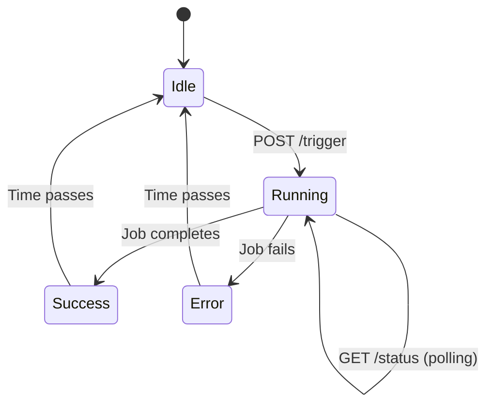

# 🔌 Manual Sync API Documentation

## 📍 Endpoints

### 1. Trigger Sync Job
**POST** `/admin/sync/trigger`

### 2. Check Sync Status
**GET** `/admin/sync/status`

---

## 🚀 POST /admin/sync/trigger

Manually triggers the product sync job.

### Request

```bash
curl -X POST http://localhost:9000/admin/sync/trigger \
  -H "Content-Type: application/json" \
  -H "Authorization: Bearer YOUR_ADMIN_TOKEN"
```

### Response (Success - 200)

```json
{
  "status": "success",
  "message": "Sync job triggered successfully",
  "data": {
    "startedAt": "2026-01-07T13:33:12.000Z",
    "checkStatusAt": "/admin/sync/status"
  }
}
```

### Response (Already Running - 409)

```json
{
  "status": "error",
  "message": "Sync job is already running",
  "data": {
    "startedAt": "2026-01-07T13:30:00.000Z"
  }
}
```

### Response (Error - 500)

```json
{
  "status": "error",
  "message": "Error message here"
}
```

---

## 📊 GET /admin/sync/status

Get the current status of the sync job.

### Request

```bash
curl -X GET http://localhost:9000/admin/sync/status \
  -H "Authorization: Bearer YOUR_ADMIN_TOKEN"
```

### Response (Idle)

```json
{
  "status": "success",
  "data": {
    "isRunning": false,
    "lastRun": null,
    "lastStatus": "idle",
    "lastError": null,
    "lastDuration": null,
    "stats": {
      "created": 0,
      "updated": 0,
      "errors": 0
    }
  }
}
```

### Response (Running)

```json
{
  "status": "success",
  "data": {
    "isRunning": true,
    "lastRun": "2026-01-07T13:33:12.000Z",
    "lastStatus": "running",
    "lastError": null,
    "lastDuration": null,
    "stats": {
      "created": 0,
      "updated": 0,
      "errors": 0
    }
  }
}
```

### Response (Success)

```json
{
  "status": "success",
  "data": {
    "isRunning": false,
    "lastRun": "2026-01-07T13:33:12.000Z",
    "lastStatus": "success",
    "lastError": null,
    "lastDuration": 12.34,
    "stats": {
      "created": 194,
      "updated": 0,
      "errors": 0
    }
  }
}
```

### Response (Error)

```json
{
  "status": "success",
  "data": {
    "isRunning": false,
    "lastRun": "2026-01-07T13:33:12.000Z",
    "lastStatus": "error",
    "lastError": "Network timeout",
    "lastDuration": 5.67,
    "stats": {
      "created": 0,
      "updated": 0,
      "errors": 194
    }
  }
}
```

---

## 🧪 Testing the API

### Test 1: Trigger Sync

```bash
# Trigger the sync
curl -X POST http://localhost:9000/admin/sync/trigger

# Expected output:
# {
#   "status": "success",
#   "message": "Sync job triggered successfully",
#   "data": {
#     "startedAt": "2026-01-07T13:33:12.000Z",
#     "checkStatusAt": "/admin/sync/status"
#   }
# }
```

### Test 2: Check Status While Running

```bash
# Check status immediately
curl -X GET http://localhost:9000/admin/sync/status

# Expected output:
# {
#   "status": "success",
#   "data": {
#     "isRunning": true,
#     "lastRun": "2026-01-07T13:33:12.000Z",
#     "lastStatus": "running",
#     ...
#   }
# }
```

### Test 3: Check Status After Completion

```bash
# Wait 15 seconds, then check status
sleep 15
curl -X GET http://localhost:9000/admin/sync/status

# Expected output:
# {
#   "status": "success",
#   "data": {
#     "isRunning": false,
#     "lastStatus": "success",
#     "lastDuration": 12.34,
#     "stats": {
#       "created": 194,
#       "updated": 0,
#       "errors": 0
#     }
#   }
# }
```

### Test 4: Try to Trigger While Running

```bash
# Trigger sync
curl -X POST http://localhost:9000/admin/sync/trigger

# Immediately trigger again
curl -X POST http://localhost:9000/admin/sync/trigger

# Expected output (second request):
# {
#   "status": "error",
#   "message": "Sync job is already running",
#   "data": {
#     "startedAt": "2026-01-07T13:33:12.000Z"
#   }
# }
```

---

## 🔧 Implementation Details

### File Location
```
src/api/admin/sync/route.ts
```

### Key Features

1. **Status Tracking**
   - Tracks if sync is currently running
   - Records last run time
   - Stores last status (idle/running/success/error)
   - Saves error messages
   - Tracks duration

2. **Prevents Concurrent Runs**
   - Returns 409 error if sync is already running
   - Ensures only one sync runs at a time

3. **Background Execution**
   - Sync runs in background
   - API returns immediately
   - Client can poll status endpoint

4. **Error Handling**
   - Catches and stores errors
   - Updates status on failure
   - Logs errors to console

---

## 📝 Code Walkthrough

### Status Object

```typescript
let syncStatus = {
    isRunning: false,           // Is sync currently running?
    lastRun: null,              // When did it last run?
    lastStatus: "idle",         // idle | running | success | error
    lastError: null,            // Last error message
    lastDuration: null,         // How long did it take?
    productsCreated: 0,         // Stats: created
    productsUpdated: 0,         // Stats: updated
    errors: 0,                  // Stats: errors
}
```

### GET Endpoint Flow

```
1. Client requests status
   ↓
2. Read syncStatus object
   ↓
3. Return current status
```

### POST Endpoint Flow

```
1. Client triggers sync
   ↓
2. Check if already running
   ↓
3. If running → Return 409 error
   ↓
4. If not running:
   a. Set isRunning = true
   b. Set lastRun = now
   c. Set lastStatus = "running"
   ↓
5. Start sync job in background
   ↓
6. Return success response immediately
   ↓
7. When job completes:
   a. Set isRunning = false
   b. Set lastStatus = "success" or "error"
   c. Set lastDuration
   d. Set lastError (if error)
```

---

## 🎨 Frontend Integration

### React Example

```typescript
// Trigger sync
const triggerSync = async () => {
  const response = await fetch('/admin/sync/trigger', {
    method: 'POST',
    headers: {
      'Content-Type': 'application/json',
      'Authorization': `Bearer ${token}`
    }
  })
  
  const data = await response.json()
  
  if (data.status === 'success') {
    console.log('Sync started at:', data.data.startedAt)
    // Start polling for status
    pollStatus()
  } else {
    console.error('Failed to start sync:', data.message)
  }
}

// Poll status
const pollStatus = async () => {
  const interval = setInterval(async () => {
    const response = await fetch('/admin/sync/status', {
      headers: {
        'Authorization': `Bearer ${token}`
      }
    })
    
    const data = await response.json()
    
    if (!data.data.isRunning) {
      clearInterval(interval)
      
      if (data.data.lastStatus === 'success') {
        console.log('Sync completed successfully!')
        console.log('Created:', data.data.stats.created)
        console.log('Updated:', data.data.stats.updated)
      } else {
        console.error('Sync failed:', data.data.lastError)
      }
    } else {
      console.log('Sync still running...')
    }
  }, 2000) // Poll every 2 seconds
}
```

### Simple Button Component

```tsx
import { useState, useEffect } from 'react'

export const SyncButton = () => {
  const [status, setStatus] = useState(null)
  const [loading, setLoading] = useState(false)
  
  const triggerSync = async () => {
    setLoading(true)
    
    const response = await fetch('/admin/sync/trigger', {
      method: 'POST'
    })
    
    const data = await response.json()
    
    if (data.status === 'success') {
      // Start polling
      const interval = setInterval(async () => {
        const statusRes = await fetch('/admin/sync/status')
        const statusData = await statusRes.json()
        
        setStatus(statusData.data)
        
        if (!statusData.data.isRunning) {
          clearInterval(interval)
          setLoading(false)
        }
      }, 2000)
    }
  }
  
  return (
    <div>
      <button 
        onClick={triggerSync}
        disabled={loading || status?.isRunning}
      >
        {loading ? 'Syncing...' : 'Sync Products'}
      </button>
      
      {status && (
        <div>
          <p>Status: {status.lastStatus}</p>
          <p>Created: {status.stats.created}</p>
          <p>Updated: {status.stats.updated}</p>
          <p>Errors: {status.stats.errors}</p>
        </div>
      )}
    </div>
  )
}
```

---

## 🔍 Monitoring

### Check Logs

```bash
# Watch Medusa logs
npm run dev

# Look for:
# ✅ Manual sync completed successfully
# OR
# ❌ Manual sync failed: [error message]
```

### Check Database

```bash
# After sync completes, verify products
npx medusa exec -c "
const query = container.resolve('query');
const { data } = await query.graph({
  entity: 'product',
  fields: ['id']
});
console.log('Total products:', data.length);
"
```

---

## 🚨 Troubleshooting

### Issue: 409 Error (Already Running)

**Cause**: Sync is already in progress

**Solution**: Wait for current sync to complete or check status

```bash
# Check status
curl -X GET http://localhost:9000/admin/sync/status

# Wait for isRunning to be false
```

### Issue: Sync Never Completes

**Cause**: Job crashed or stuck

**Solution**: Restart Medusa

```bash
# Stop Medusa
# Ctrl+C

# Start again
npm run dev
```

### Issue: Status Shows "running" but Nothing Happens

**Cause**: Status not updated after crash

**Solution**: Reset status (restart Medusa or manually reset)

```typescript
// In route.ts, add a reset endpoint
export const DELETE = async (req: MedusaRequest, res: MedusaResponse) => {
    syncStatus.isRunning = false
    syncStatus.lastStatus = "idle"
    res.json({ status: "success", message: "Status reset" })
}
```

---

## 📊 Status States



---

## 🎯 Best Practices

1. **Poll Status**: Don't assume sync completes instantly
2. **Handle Errors**: Check for 409 and 500 errors
3. **Show Progress**: Display status to user
4. **Prevent Spam**: Disable button while running
5. **Timeout**: Set a reasonable timeout (e.g., 60 seconds)

---

## 📈 Performance

| Metric | Value |
|--------|-------|
| **Response Time** | < 100ms (immediate) |
| **Sync Duration** | ~12-15 seconds |
| **Polling Interval** | 2 seconds recommended |
| **Max Concurrent** | 1 sync at a time |

---

## 🔗 Related Documentation

- [Product Sync Job](../docs/04-implementation.md)
- [Testing Guide](../docs/06-testing.md)
- [Troubleshooting](../docs/07-troubleshooting.md)

---

**Your manual sync API is now ready to use!** 🚀
